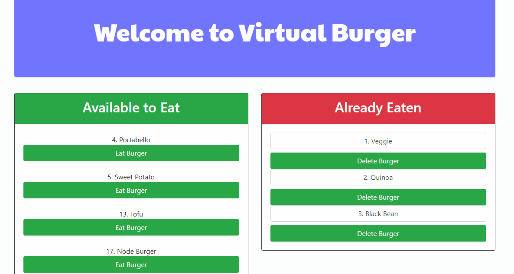

# burger

## Getting Started

Welcome to Virtual Burger! This is a burger logger that allows you, the client, to create a virtual burger, or devour a virtual burger. with MySQL, Node, Express, Handlebars and a homemade ORM. It follows the MVC design pattern, using Node and MySQL to query and route data, and Handlebars to generate the HTML.



For a demo of the app, visit: <https://aqueous-castle-58496.herokuapp.com>

### Prerequisites

To download and test this app, you will need the Node Packet Manager installed.  For more information, visit: <https://www.npmjs.com/get-npm>

You will also need Node.js installed.  For more information, visit <https://nodejs.org/en/download/>

### Installing

To install, access the Github page <https://github.com/digipet007/burger>.  You may fork the repository and then clone it to your computer.  

Next, you will need to download the required NPM packages.  The required NPM packages include:
```
"body-parser": "^1.19.0",
"express": "^4.17.1",
"express-handlebars": "^3.1.0",
"method-override": "^3.0.0",
"mysql": "^2.17.1"
```
Because these packages are listed as dependencies already in the package.json file, you may install these packages by typing `npm install` on the commandline.

This app uses MySQL. You will need to set up your database by uploading the information in the `schema.sql` and the `seeds.sql` files in the db (database) folder. 

You will also need create a new file for connecting to MySQL called `connection.js`. Create this within the config folder.
To set up your config, copy and paste the following information and fill in you password.

```
var mysql = require('mysql');
var connection;

if (process.env.JAWSDB_URL) {
    connection = mysql.createConnection(process.env.JAWSDB_URL);
} else {
    connection = mysql.createConnection({
        host: 'localhost',
        user: 'root',
        password: '',
        database: 'burgers_db'
    })
}

connection.connect();
module.exports = connection;
```

Your app should now be ready for testing and then deployment.

## Running tests

Then, To use this app on your local device, and store the data on MySQL, run the following command on the command line:
```
node server.js
```

Then go to the following URL in your browser: `localhost:8080`
You should be able to click on the eat button to move a burger to the eaten list, and enter data to create a new burger. 

## Deployment and General Use
This app can be deployed to a server, such as Heroku or AWS, for online use from different users in different locations. To store data input, you will need to utilize an online database, such as the JAWSDB_URL add-on offered by Heroku.

## Built With

* Javascript
* Bootstrap Framework

The following packages were used to create this app:
* body-parser 
* express
* express-handlebars
* method-override
* mysql

## Author

* **Sarah Arnold** --view my portfolio and bio: <https://digipet007.github.io/Sarahs-Portfolio/>
